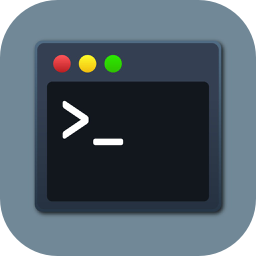
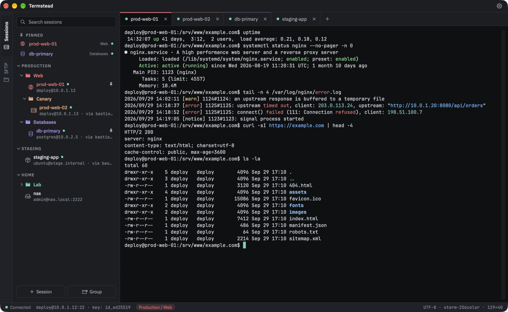
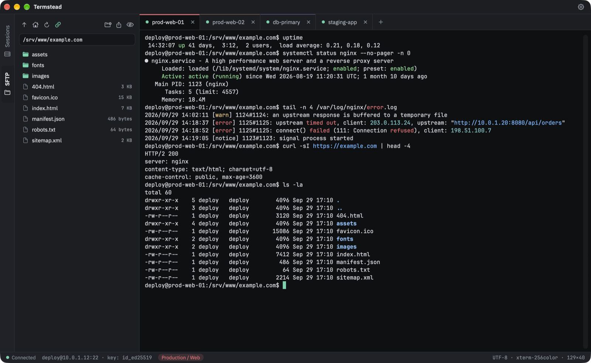
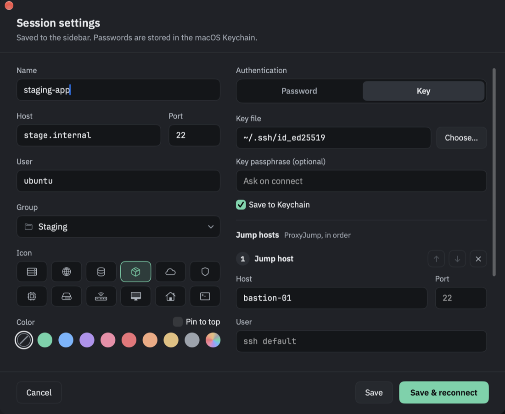

<p align="center">
  
</p>

<h1 align="center">Termstead</h1>

<p align="center">
  <a href="https://github.com/pkhorenyan/termstead/releases/latest"></a>
  
  
  
  <a href="LICENSE"></a>
  <a href="https://github.com/pkhorenyan/homebrew-tap"></a>
</p>

<p align="center">
  A native macOS SSH client for people who keep a lot of servers in their head —
  sessions in a tree, jump hosts, SFTP next to the terminal, and passwords in the
  macOS Keychain. Built for anyone coming from MobaXterm who wants the same way
  of working, as a real Mac app.
</p>



## Features

- **Sessions in a tree.** Groups and subgroups, colors that the sessions inside
  take on, an icon per session, pinned favorites at the top, search, drag and
  drop to reorder.
- **Jump hosts.** Chain as many as you need; a jump host can be a saved session,
  with its own user, key or password.
- **Passwords and key passphrases in the Keychain**, entered for you when ssh
  asks — and only for the host they were saved for.
- **SFTP beside the terminal.** The SFTP tab browses the server over the
  connection that is already open, so it never asks for a password again, and
  the sidebar turns to it as soon as you are logged in. It
  can follow the terminal's current folder; drag files in to upload and out to
  download; open a remote file in its Mac app and it is uploaded again each
  time you save.
- **Import from `~/.ssh/config`** — your existing hosts become sessions in one
  click.
- **Find in the output** (⌘F), with the scrollback size of your choice.
- **Keyword highlighting** of errors, warnings, IP addresses and URLs in output
  the server did not color itself — or, for network gear, interface names,
  up/down and MAC addresses too.
- **Six themes** — Graphite, Midnight, Ember, High contrast, Daylight, Sepia —
  following macOS light and dark mode if you like, any monospaced font,
  copy on select, Option as Meta.
- **It is the real OpenSSH.** Each tab runs the system `ssh`, so your agent,
  `~/.ssh/config`, `known_hosts` and `ProxyJump` all work exactly as in
  Terminal.

<p align="center">
  
  
</p>

## Install

Termstead needs **macOS 14 Sonoma or later**, on Apple silicon or Intel.

**Homebrew:**

```sh
brew install --cask pkhorenyan/tap/termstead
```

**Or download** the latest `Termstead.dmg` from
[Releases](https://github.com/pkhorenyan/termstead/releases/latest), open it and
drag Termstead to Applications.

Termstead keeps itself up to date: it looks for a new version once a day, and
**Termstead ▸ Check for Updates…** does it on demand. Every update is verified
against the project's signing key before it is installed.

## Security and privacy

- Termstead has **no SSH code of its own**. Connections, keys, host
  verification and encryption are all OpenSSH's, as shipped with macOS.
- Passwords and passphrases are kept in your **login Keychain**. A password is
  handed to ssh only for the exact `user@host` it was saved for, and each saved
  secret is offered once — if the server refuses it, you are asked in the
  terminal as usual.
- The ssh configuration for each connection is written to a private temporary
  folder, readable only by you, and deleted when the tab closes.
- Sessions are stored in `~/Library/Application Support/Termstead/sessions.json`.
  Nothing is sent anywhere: no accounts, no analytics.

## Keyboard shortcuts

| | |
|---|---|
| New session / New group | ⌘N / ⇧⌘N |
| Connect to the selected session | ⌘O |
| Session settings | ⌘I |
| Quick connect by address | ⌘K |
| New tab / Close tab | ⌘T / ⌘W |
| Find / Next / Previous | ⌘F / ⌘G / ⇧⌘G |
| Text size in the tab: bigger / smaller / default | ⌘+ / ⌘− / ⌘0 |
| Settings | ⌘, |

Double-click a session to connect. A closed tab keeps its output — press Return
to reconnect.

## Build from source

```sh
brew install xcodegen
xcodegen generate
xcodebuild -project Termstead.xcodeproj -scheme Termstead -configuration Release \
  -derivedDataPath build build
open build/Build/Products/Release/Termstead.app
```

Architecture, tests and development notes are in [CLAUDE.md](CLAUDE.md).

## License

Copyright © 2026 Pavel Khorenyan.

Termstead is free software: you can redistribute it and/or modify it under the
terms of the GNU General Public License as published by the Free Software
Foundation, either version 3 of the License, or (at your option) any later
version. It is distributed in the hope that it will be useful, but without any
warranty; see the [LICENSE](LICENSE) for details.

The Termstead name and the app icon are not covered by that license. Forks are
welcome, under a name and an icon of their own, so that nobody mistakes them for
this app.

It includes [SwiftTerm](https://github.com/migueldeicaza/SwiftTerm) by Miguel de
Icaza (MIT), vendored with small patches,
[Sparkle](https://sparkle-project.org) for updates (MIT), and the typefaces
[JetBrains Mono](https://www.jetbrains.com/lp/mono/) and
[IBM Plex Sans](https://www.ibm.com/plex/), both under the SIL Open Font
License 1.1. Their license texts travel inside the app, in
`Contents/Resources/Licenses`.
